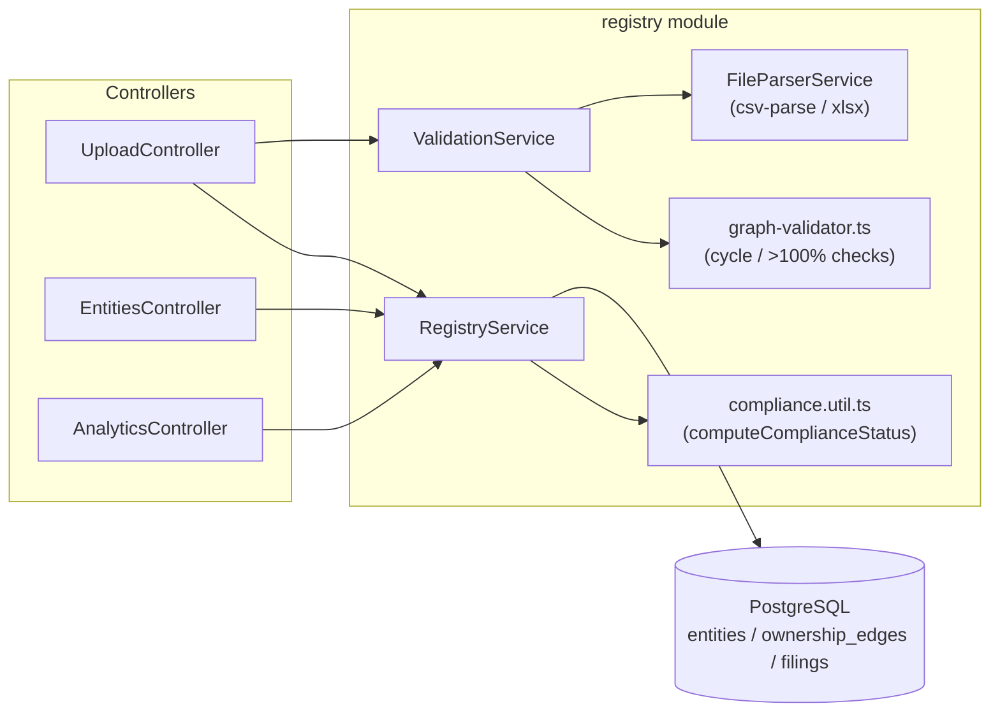

# Backend route logic

One doc per HTTP route, focused on **what happens inside the handler** — not
setup/deployment (see the [top-level README](../../README.md) for that).

| Route | Doc | Purpose |
|---|---|---|
| `POST /api/upload` | [upload.md](./upload.md) | Validate + atomically write the three CSV/XLSX files |
| `GET /api/entities` | [entities.md](./entities.md) | Browsable entity hierarchy with computed compliance status |
| `GET /api/analytics` | [analytics.md](./analytics.md) | Aggregates for the frontend's four charts |
| `GET /api/health` | — | Trivial liveness check (`app.controller.ts`), not documented separately |

## Shared building blocks

All three data routes sit on the same small set of modules:

- **`FileParserService`** turns a `.csv` or `.xlsx` upload into the same
  `{ header, rows }` shape regardless of format, so every validator downstream
  is format-agnostic.
- **`ValidationService`** runs all row-level, cross-file, and graph-level
  checks and never touches the database except to read (for the business-ID
  and existing-edges cross-checks).
- **`RegistryService`** is the only thing that writes, and the only thing
  that computes compliance status for a response (`compliance.util.ts`).
  Compliance status is **never stored** — it's derived at read time from
  `entityStatus`, the entity's filings, and "today".
