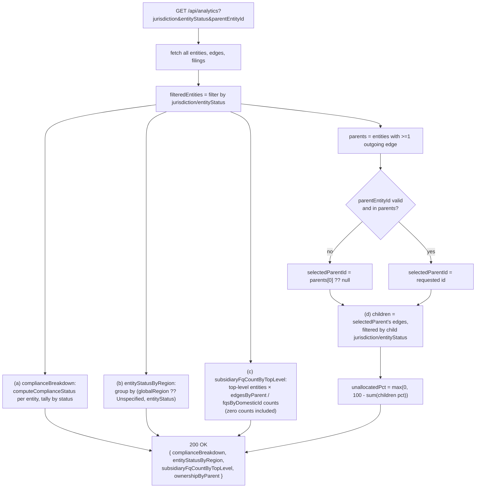

# `GET /api/analytics`

**Files:** [`analytics.controller.ts`](../../src/registry/analytics.controller.ts) →
[`registry.service.ts`](../../src/registry/registry.service.ts) (`getAnalytics`)

Returns the four aggregates the frontend's `/analytics` page charts. Query
params: `jurisdiction`, `entityStatus` (both filter the entity set before any
aggregation runs), `parentEntityId` (selects which parent the ownership-%
breakdown is computed for; defaults to the first parent alphabetically).

## Core logic (`getAnalytics`)

1. Fetch all entities, edges, filings (same unfiltered full-table reads as
   `/api/entities`).
2. Apply `jurisdiction` / `entityStatus` filters to entities once, up front
   → `filteredEntities`, reused by aggregates (a), (b), and (c). Aggregate
   (d) applies filtering separately, scoped to one parent's children.
3. **(a) Compliance status breakdown** — every row in `filteredEntities`
   (top-level, subsidiary, and FQ alike — this is a flat count, not
   hierarchy-aware) run through the same `computeComplianceStatus` used by
   `/api/entities`, tallied by status.
4. **(b) Entity status by region** — grouped by `(globalRegion ??
   'Unspecified', entityStatus)`, counted. Entities with no `globalRegion`
   set fall into an `'Unspecified'` bucket rather than being dropped.
5. **(c) Subsidiary/FQ counts per top-level entity** — for each top-level
   entity (same "no incoming edge" definition as `/api/entities`), counts its
   direct subsidiaries (`edgesByParent`) and direct FQs (`fqsByDomesticId`).
   Top-level entities with zero children are still included (with `0`
   counts) so the chart doesn't silently omit them.
6. **(d) Ownership % by parent**:
   - `parents` = every entity that appears as a parent in `ownership_edges`
     (from `filteredEntities`), alphabetical.
   - Resolve `selectedParentId`: the requested `parentEntityId` if it's
     actually in `parents`, else `null`; if still `null` and `parents` is
     non-empty, default to `parents[0]` — the chart is never blank on first
     load just because the client didn't pass a parent.
   - For the selected parent, take its outgoing edges, filtered again by
     `jurisdiction`/`entityStatus` against each **child's** own fields (not
     the parent's).
   - `unallocatedPct = max(0, 100 - sum(children pct))`, rounded to 2
     decimals — the remainder is rendered as its own segment so a
     partially-owned entity's chart still visually sums to 100%.

## Flow diagram

