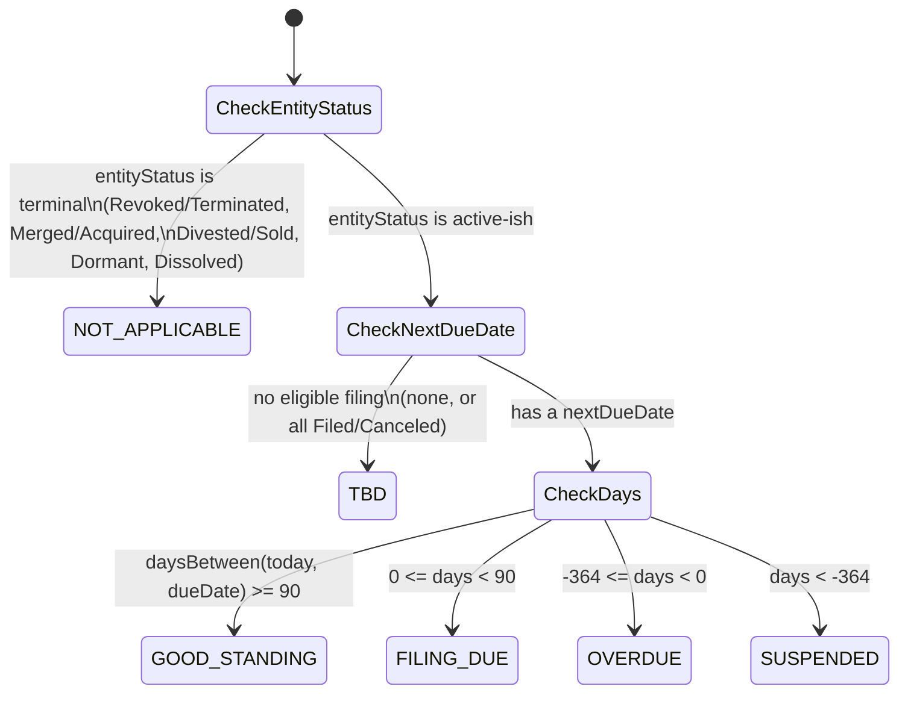
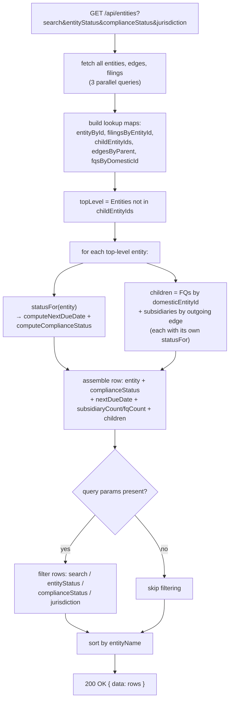

# `GET /api/entities`

**Files:** [`entities.controller.ts`](../../src/registry/entities.controller.ts) →
[`registry.service.ts`](../../src/registry/registry.service.ts) (`getEntitiesList`) →
[`compliance.util.ts`](../../src/registry/compliance/compliance.util.ts)

Returns top-level entities (no incoming ownership edge — i.e. nobody owns
them), each expandable to its direct FQs and subsidiaries **one level deep**.
Every row, top-level or child, gets its own independently computed
compliance status.

Query params: `search` (substring on entity name), `entityStatus`,
`complianceStatus`, `jurisdiction` — all applied client-side against the
in-memory computed rows, after building the full hierarchy.

## Core logic (`getEntitiesList`)

1. Fetch **all** entities, ownership edges, and filings in one `Promise.all`
   — there's no server-side pagination, so this is the whole table each call
   (fine at demo-data scale; see the backend README's trade-offs section).
2. Build lookup structures: `entityById`, `filingsByEntityId` (grouped),
   `childEntityIds` (anything that's the child of some edge — used to find
   top-level entities), `edgesByParent` (grouped), `fqsByDomesticId`
   (grouped FQ entities keyed by their `domesticEntityId`).
3. **`statusFor(entity)`** — the per-row compliance computation, reused for
   top-level entities, subsidiaries, and FQs identically:
   - Collect that entity's filings, map to `{ dueDate, status }`.
   - `computeNextDueDate` — earliest `dueDate` among filings that are **not**
     `Filed` and **not** `Canceled`; `null` if none are eligible.
   - `computeComplianceStatus(entityStatus, nextDueDate, today)` — see the
     status ladder below.
4. **Top-level entities** = `registrationType === 'Entity'` AND not present
   in `childEntityIds` (i.e. no parent owns it).
5. For each top-level entity, build its `children` array:
   - **FQs**: every entity with `registrationType === 'FQ'` whose
     `domesticEntityId` points at this entity. `ownershipPct` is always
     `null` for FQs (ownership doesn't apply).
   - **Subsidiaries**: every entity reached via an outgoing `ownership_edges`
     row from this entity, carrying that edge's `ownershipPct`.
   - `children = [...fqs, ...subsidiaries]` — FQs listed before
     subsidiaries; the frontend's `RelationChip` distinguishes them visually.
6. Apply the four query-param filters against the now-fully-computed rows
   (`search` matches only the **top-level** entity's own name, not its
   children's names).
7. Sort by `entityName` and return `{ data: rows }`.

### The compliance-status ladder (`compliance.util.ts`)

Entity Status is checked **first** and wins outright — a Dissolved entity
years overdue on a filing is `NOT_APPLICABLE`, not `SUSPENDED`.

`daysBetween` is UTC-normalized (via `Date.UTC` on y/m/d) specifically so DST
transitions never shift a day across a status boundary.

## One-level-deep limitation

A subsidiary's own subsidiaries exist in the data (fully validated and
persisted as ordinary `ownership_edges` rows) but are **not** nested further
in this response — `children` is always exactly one level. See the backend
README's "what wasn't built" section for the reasoning.

## Flow diagram

