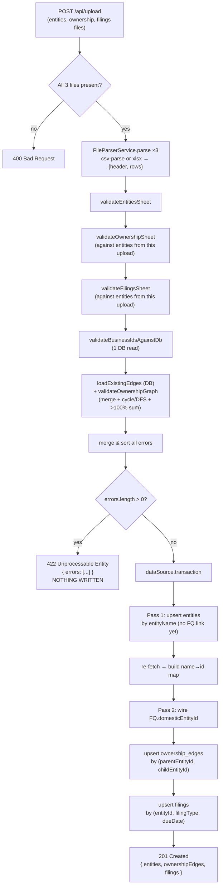

# `POST /api/upload`

**Files:** [`upload.controller.ts`](../../src/registry/upload.controller.ts) →
[`validation.service.ts`](../../src/registry/validation/validation.service.ts) →
[`registry.service.ts`](../../src/registry/registry.service.ts) (`processUpload`)

Accepts `multipart/form-data` with three file fields (`entities`, `ownership`,
`filings`, each `.csv` or single-sheet `.xlsx`). Either **everything** gets
written, or **nothing** does — the whole batch is validated before any DB
write is attempted.

## Core logic

1. **Controller** (`upload.controller.ts:41`) checks all three fields were
   sent (400 if not), then hands the raw `Express.Multer.File`s to
   `RegistryService.processUpload`.
2. **`processUpload`** (`registry.service.ts:50`) first calls
   `ValidationService.validateUpload` and inspects its `errors` array. Any
   errors → throws `UnprocessableEntityException({ errors })` (HTTP 422)
   *before* opening a database transaction. This is why "reject the whole
   batch atomically" doesn't need a savepoint/rollback dance — the write path
   simply never starts.
3. **`ValidationService.validateUpload`** (`validation.service.ts:42`):
   - Parses all three files via `FileParserService.parse` (CSV → `csv-parse`,
     XLSX → SheetJS, both reduced to `string[][]` with spreadsheet-native line
     numbers — header is line 1).
   - Runs each sheet's dedicated validator (`entities-validator.ts`,
     `ownership-validator.ts`, `filings-validator.ts`) — required columns,
     per-field type/enum/date checks, and intra-file uniqueness
     (`Entity Name`, `Entity/Business ID`, ownership pairs, filing keys).
   - Cross-references: `ownership.csv` and `filings.csv` rows must resolve
     against `entities.csv` **rows from this same upload**, not the DB —
     every upload is treated as a self-consistent snapshot.
   - `validateBusinessIdsAgainstDb` — the one DB read during validation:
     rejects a `Business ID` already claimed by a *different* entity name.
   - `validateOwnershipGraph` (see below) — merges this upload's edges onto
     the **already-persisted** graph and checks for cycles / any child's
     ownership summing over 100%.
   - All errors from every stage are concatenated and sorted by file order →
     line → column, so the response reads top-to-bottom like the spreadsheet.
4. If `errors` is empty, `processUpload` opens one `DataSource.transaction`
   and, in order:
   - **Pass 1** — upsert every `entities.csv` row by natural key
     (`entityName`), *without* wiring `domesticEntityId` yet (the FQ's parent
     row might not have an id assigned until this same pass finishes).
   - Re-fetch all entities to build a `name → id` map.
   - **Pass 2** — for FQ rows, `UPDATE ... domestic_entity_id` now that every
     name in the batch has an id.
   - Upsert `ownership_edges` by `(parentEntityId, childEntityId)`.
   - Upsert `filings` by `(entityId, filingType, dueDate)`.
   - Returns `{ entities, ownershipEdges, filings }` row counts (HTTP 201).

Re-running the same files is idempotent — every write is an upsert on a
natural key, so nothing duplicates.

## Ownership graph validation (`graph-validator.ts`)

Cycle and over-100% detection run against the **merged** graph (this
upload's edges layered onto whatever's already in `ownership_edges`), because
a re-upload only carries the edges it's changing — an untouched historical
edge is still part of the graph that must stay acyclic.

- Build an adjacency map from `parent → [children]` over the merged edge set.
- DFS with white/gray/black coloring; any node revisited while `GRAY` (i.e.
  still on the current recursion stack) means every node between it and the
  stack-top is part of a cycle → flagged.
- Sum ownership % per child across **all** parents in the merged set; if any
  child's total exceeds 100%, every upload row touching that child is
  flagged.

## Flow diagram

